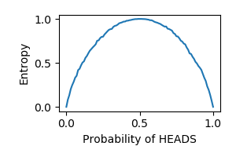

### Baselines

#### Entropy - entropy_baseline.py
For the range of probabilities of HEADS in a coin flip, entropy should be maximum for p=0.5 and have the general shape of an inverted-U.

#### Mutual Information - mi_baseline.py
Mutual information should be high for identical variables, as shown in first panel. It should also should be high for variables where bins even though there is no direct correlation between x and y, knowledge of x is highly indicative of y. In the illustration in the second panel, the data is binned so that identifying the bin in which x falls can determine which bin y will fall in. This illustrates mutual information as a generalized measure of correlation. Furthermore, mutual information should be slightly lower for noisy identical variables and low for random variables. It is normalized to be in [0,1] for this baseline.

#### Parital Information decomposition - pid_baseline.py
For an XOR gate, by its definition each input provides no unique information, and hence no redundant information. The output of an XOR gate can only be inferred through the synergistic information of both inputs combined. This should show up in the partial information decomposition of the total mutual information between inputs and outputs in an XOR gate. However, in an AND gate the output can be determined to be 0, if one of the inputs is 0, and so the other input is redundant in that case; and an output of 1 can only be inferred if both information from both inputs are together known to be 1. This also can be brought out from partial information decomposition. See Table 1. in https://goo.gl/5u6ecX for corroboration of numbers shown below.

        2-input XOR
        total_mi = 1.0
        redundant_info = 0.0
        unique_1 = 0.0
        unique_2 = 0.0
        synergy = 1.0

        2-input AND
        total_mi = 0.8112781244591328
        redundant_info = 0.31127812445913283
        unique_1 = 0.0
        unique_2 = 0.0
        synergy = 0.5
